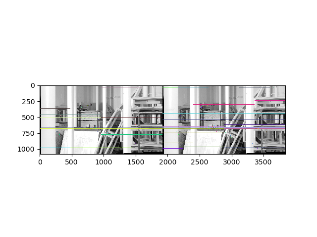
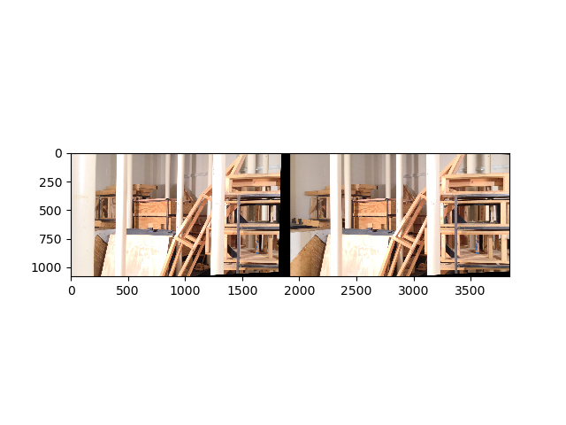
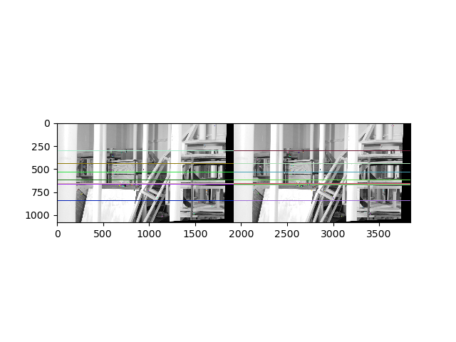
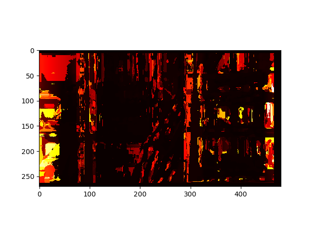
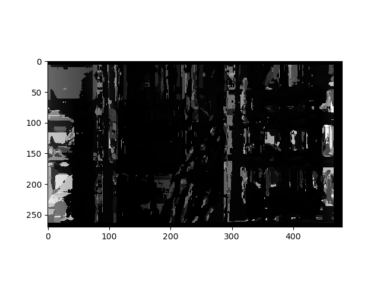
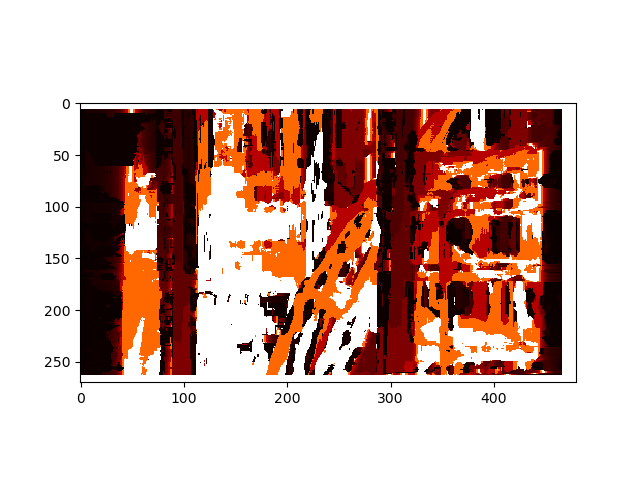
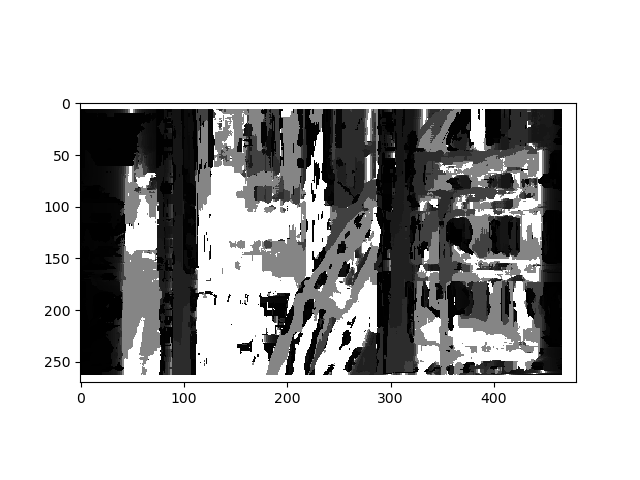

# Stereo-Vision
Calculating depth information and generating a disparity map for multiple images from the same scene using stereo vision

### Pipeline
<ul>
<li> Use a SIFT feature detector to detect a set of keypoints and their respective features in each image.
<li> Using a FLANN Feature Matcher, compute a set of matched features between the two images.
<li> Perform RANSAC (Random Sampling Consensus) to get the best estimate of the fundamental matrix from the first to the second image. Considering K1 and K2 to be the intrinsic camera matrices of the first and second image, compute the essential matrix.
<li> With a Singular Value Decomposition (SVD) formulation, compute the rotational (R) and translational (T) transformations for going from the first to the second image.
<li> Draw the epipolar lines for this unrectified image pair. The lines can be in an arbitary manner depending upon how the two images are oriented.
<li> With the matched points and the fundamental matrix, retify the stereo image pair i.e. obtain homographies to warp each image such that the images of the two are only horizontally shifted (have no vertical translation or any type of rotation).
<li> Redraw the epipolar lines but this time for the rectified image pair. You should observe all the epipolar lines to now become horizontal and parallell to eachother. This signifies that the stereo pair has been correctly rectified.
<li> Use block matching to compute the the disparity map with respect to the left aligned image. Disparity is basically the difference between the X pixel coordinate value corresponding to a certain part of the image scene. This is done for every pixel of the left aligned image. The disparity map is computed by assuming a window/block size and matching the best possible location of that window/block in the second/right aligned image by minimizing the sum-of-absolute-distances (SAD) to the block in th left-aligned image. This map can be displayed both as a heatmap and a grayscale image.
<li> The disparity map can then be used to get the depth map using the formula Depth = (FocalLength * CameraBaseline)/Disparity.
The camera baseline is the distance between the two camera centers and the focal length is a parameter of the intrinsic camera matrix. By applying this formula to erach pixel of the disparity map, we can obtain the depth map corresponding to accurate depth values for ech pixel. However, thresholding and approximation of the depth map is required to get visually reasonable results with each pixel in the 8-bit (0-255) range. Thi depth map too can be represented both as a heatmap and grayscale image.
</ul>

### Results

The results of computing the depth map and all the intermediate setps in doing so for one of the datasets are listed below.

Initial set of epipolar lines for the pair before rectification (non-horizontal)

  

The rectified image pair shown side by side

  

The epipolar lines for the rectified image pair (now horizontal)

  

The disparity map as a heatmap and grayscale image.

  

  

The depth map as a heatmap and grayscale image.

  

  

